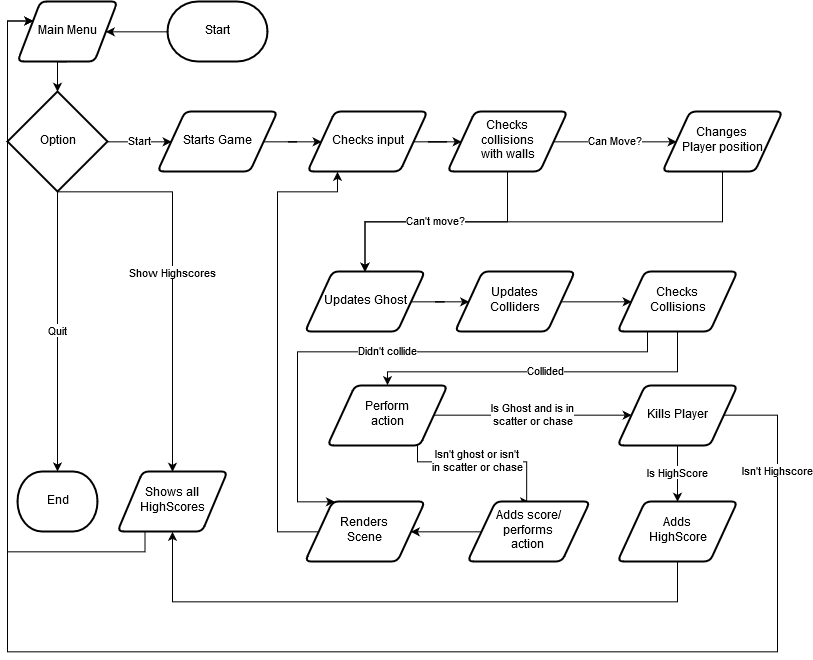

# LP2_P2 - Pac-Man

André Vitorino - a21902663  
Hugo Feliciano - a21805809  
Pedro Inácio &nbsp; &nbsp; - a21802056

## Repository

<https://github.com/Xx-hugo-xX/LP2_P2/tree/master>

## Distribution

### André Vitorino

On the "Object" and "DefaultObject" classes, the student André Vitorino
constructed the entire classes and their logic, as well as commented and added
the XML to the entirety of both those classes.

The student constructed the "Physics" and "Ghost" classes, creating and
perfecting the AI of the Ghosts and their behavior, setting their target
according to their state. [5],[6]  
The student also commented and added the XML to the entirety of both of those
classes.

On the "GameLoop" class, the student created the class and implemented the
methods "GenerateMap", "SetBufferGhostVisuals" and "ConvertMapToDoubleArray",
updated most of the "Render" method that displays the visuals of the game,
and commented and added the XML to part of the class.  
In addition, the student created the code on the methods
"UpdatePlayerDirection", "CheckForCollisions", "UpdateGhostState",
"UpdateGhostBehaviour" and "SpawnGhosts". This code was first created on the
"Update" method, and was later separated in methods by the student
Pedro Inácio.

The student also created the "GhostState" and "ObjectType" Enums.

Finally, on the "Position" class, the student created the operators "==" and
"!=", as well as the mandatory override methods of "Equals" and "GetHashCode".

### Hugo Feliciano

On the class "MainMenu", the student Hugo Feliciano constructed the logic of
the Menu and its input, as well as the method that displays the HighScores and
the method that quits the Menu, and commented the entire class.

The student also created the "HighScoreManager" class and constructed all of
its methods and logic (creating a file with all the HighScores and saving the
current players score if he beats any of the HighScores), as well as commented
and added all the XML of that class.[1]

The student created the "Death" method on the "Player" class, that displays a
Game Over message and calls the "AddHighScore" method of the "HighScoreManager"
class.

Finally, the student created the "Position" class and its constructor, and
commented and added the XML to the entire class;

### Pedro Inácio

On the "DoubleBuffer2D" and "InputSystem" classes, the student Pedro Inácio
constructed the entire classes and their logic, as well as commented and added
the XML to the entirety of both those classes.[2]  
The student also created the Enum "Direction", that works with the
"InputSystem" class, and added the XML to that Enum.

The student created the method "ShowControls" on the "MainMenu" class,
as well as its logic, and added the XML to the entire class.

The student also created the "Player" class and its constructor,
and commented and added the XML to everything but the "Death" method.

On the "Score" class, the student constructed the entire class and its logic,
as well as commented and added the XML to the entire class.

Finally, the student created the the methods "Loop", "GeneratePickables",
"CheckForLevelFinish" and created some new methods to divide the logic from the
code made by André Vitorino (previously on the "Loop" method) on the
"GameLoop" class, improved the game mechanics, and constantly updated the class
in order to work in tandem with the student André Vitorino while he developed
and improved the AI. In addition, the student comment and added the XML to part
of the class.

## Architecture

### Description

The program as a basis works with Objects, every piece of the map and everything
in it inherits from Object, this Object must have a collider, a position, and
visuals. Most of the Objects are DefaultObjects only different in it's visual or
type, except for the Ghost and Player that have their own specific classes and
still inherit from Object. Every Object must also implement an interface
allowing that Object to give a score, then managed by a class dedicates to
storing the scores by creating, reading and writing to a file.

### Design Patterns

The design patterns applied to this project were the requested Game Loop, 
Update Method and Double Buffer design patterns, although the second one was
breached, in part, as the update methods ended up being placed in the GameLoop
class. The reason why these patterns were used are as follows:

Game Loop - Decouple the input processing, updating and rendering times from
the player's input, allowing the game to run as we see it without stopping
and waiting for the player's input;

Update Method - Create a logic of objects seemingly independent by telling
each of them to update their behaviour one frame at a time;

Double Buffer - Simulate an instantaneous sequence of operations in order to
display the game's graphics to the player without stopping the game.

### Collisons

Every Object contains a collider, an array of integers with the x, y, lenght and
width the class physics has a list of all the Objects and access to it's 
colliders and through methods checks if the poisition of the object given is 
inside any collider. This can return an Object or a list of Objects 
(With an Overload) and then compare the ObjectType with the ObjectType that 
needs to be checked. This method of collision works well for most objects
including with lenght and width, but for moving objects it can sometimes not
detect the collision.

### AI

The AI works with an A* algorithem, basically it checks the neighbors of a cell 
and gives it a cost depending on how much it has to move and how far is from the
target, if it finds a cell with a low cost adds it as a parent of the current
cell, repeating the process for the new cell. When it reaches the target creates
a list of positions by checking all the parents of all the cells from the target
till it reaches the original position. Theres two problems with this aproach, 
first, this AI is quite heavy, and the original pac-man used a simpler and more
efficient way. And second, it's making a new path every second update even if it
doesn't need to, resulting in a lower performace and development of this AI.

### Fluxogram

### UML Diagram

## References

### Code

[1] - Based on the
[project lp1_p2ep](https://github.com/Xx-hugo-xX/lp1_p2ep/tree/master)
made by the student Hugo Feliciano and the rest of his group.

[2] - Based on a
[test project](https://github.com/Freeze88/Aula11)
made by the student André Vitorino.

### Books

[3] - Joseph Albahari and Ben Albahari, *"C# 7.0 In a Nutshell"*, 2018

[4] - Robert Nystrom, *"Game Programming Patterns"*, 2014

### Website

[5] - Rachit Belwariar,
["A* Search Algorithm"](https://www.geeksforgeeks.org/a-search-algorithm/),
GeeksforGeeks, 2016

### Video

[6] - Sebastian Lague,
["A* Pathfinding (E02: node grid)"](https://www.youtube.com/watch?v=nhiFx28e7JY&start=536s), Youtube, 2014
